# PromptDrop — AI 提效模板小店

> 使命：24h 内做出第一笔成交；1 周内做到持续日收入。

## 是什么

一个**虚拟商品小店**：把"用 AI 解决具体问题"的 Prompt 模板、工作流、清单打包成 9.9–29.9 的小商品，付款即下载。

## 为什么做这个

- **1000 元启动资金的硬约束** → 不能投广告、不能压货、不能做重资产。
- **可立刻变现**：虚拟商品、零边际成本、收款码秒到账。
- **复利资产**：每成交一次，就多一个用户、一个好评、一个 SKU 迭代数据。
- **与 AI 能力高度匹配**：写 prompt / 做模板 / 调工作流是核心动作。

## 路线图

```mermaid
gantt
    title PromptDrop 路线图
    dateFormat HH:mm
    axisFormat %H:%M
    section Phase 0 MVP
    立项+文档           :done, p0a, 22:45, 30m
    落地页+3 个 SKU     :active, p0b, 23:15, 60m
    本地试运行          :p0c, 00:15, 15m
    section Phase 1 上线
    公网发布            :p1a, 00:30, 30m
    收款码接入          :p1b, 01:00, 20m
    section Phase 2 增长
    推广（小红书/闲鱼） :p2a, 01:20, 120m
    第一笔成交          :milestone, m1, 03:00, 0m
    持续迭代            :p2b, 03:00, 1440m
```

| 状态 | 节点 | 时间 |
|------|------|------|
| ✅ | 立项文档 | 22:45 |
| 🚧 | MVP 落地页 | 进行中 |
| ⏳ | 本地试运行 | 待 |
| ⏳ | 公网发布 | 待 |
| ⏳ | 收款接入 | 待 |
| ⏳ | 推广启动 | 待 |
| 🎯 | **第一笔成交** | 目标 24h 内 |
| ⏳ | 持续迭代 | — |

## 当前 SKU（v1）

| SKU | 名称 | 价格 | 状态 |
|-----|------|------|------|
| PD-001 | 小红书爆款标题 7 套模板 | ¥9.9 | 🚧 |
| PD-002 | 跨境选品调研 Prompt 包 | ¥19.9 | 🚧 |
| PD-003 | 周报/OKR 自动生成器 | ¥9.9 | 🚧 |
| PD-004 | 面试问题生成器（HR/求职者双向） | ¥14.9 | 🚧 |
| PD-005 | 论文降重+润色 Prompt 工具箱 | ¥29.9 | 🚧 |

## BDD 验收场景（用户故事）

### 场景 1：访客浏览商品
> **Given** 我访问 promptdrop.example.com
> **When** 落地页加载完成
> **Then** 我能在 5 秒内看到 3 个以上 SKU 的标题、价格、价值主张

### 场景 2：下单支付
> **Given** 我看中了"小红书爆款标题模板"
> **When** 我点击"立即购买 ¥9.9"
> **Then** 页面弹出收款码（微信/支付宝）+ 订单号 + 客服微信
> **And** 客服在 10 分钟内人工发货（v1 阶段）

### 场景 3：下载交付
> **Given** 我已完成支付并发送截图给客服
> **When** 客服确认收款
> **Then** 我立即收到一个 Notion/网盘 下载链接
> **And** 7 天内可重复下载

### 场景 4：运营复盘
> **Given** 当日有成交
> **When** 我查看 docs/DAILY.md
> **Then** 我能看到：UV、独立访客、加购数、订单数、GMV、转化率

## 反例清单（明确不做）

- ❌ 不做订阅制（v1 阶段用户认知成本高）
- ❌ 不做直播/视频课程（制作周期长）
- ❌ 不接需要资质的支付通道（先收款码手动发货）
- ❌ 不投流（除非日 GMV > 200 且 ROI > 3）
- ❌ 不做版权不清晰的 prompt（不抄别人仓库）

## 风险与对策

| 风险 | 概率 | 对策 |
|------|------|------|
| 24h 内无成交 | 中 | 立刻换 SKU / 换渠道 / 换定价 |
| 收款码被风控 | 低 | 备 2 张码轮换 |
| 落地页转化率 < 1% | 中 | A/B 标题与价格 |
| 公网发布失败 | 低 | 准备 3 套发布通道（Vercel/Cloudflare/GH Pages） |
| 主 agent 超时 | 高 | **子 agent 定时监控**（见 docs/MONITORING.md） |

## 文档索引

- `docs/BDD.md` —— 详细用户故事
- `docs/MONITORING.md` —— 子 agent 监控方案
- `docs/DAILY.md` —— 每日运营日志（成交、复盘）
- `docs/POSTMORTEM.md` —— 阶段性复盘

## 启动资金台账

| 日期 | 项目 | 金额 | 余额 |
|------|------|------|------|
| 6/28 | 起始 | — | ¥1000 |
| 6/28 | 域名（可选）| -50 | ¥950 |
| 6/28 | 收款码贴纸 | -20 | ¥930 |
| 6/28 | 备用 | 0 | ¥930 |