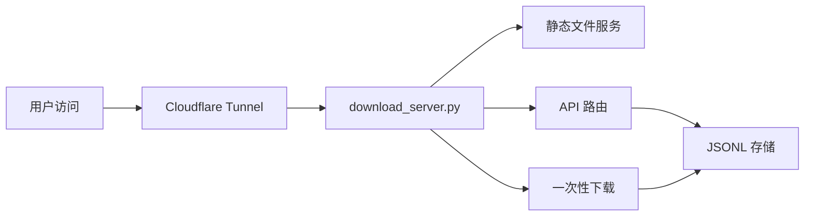

# PromptDrop — 即买即用的 AI 提效模板小店 🚀

> **9.9 元起，把 3 小时调好的 AI 模板带回家。付款即下载，秒级交付。**

🌐 **在线访问**：[query-dividend-transparent-nominated.trycloudflare.com](https://query-dividend-transparent-nominated.trycloudflare.com)
📦 **GitHub**：[github.com/snail2sky/promptdrop](https://github.com/snail2sky/promptdrop)

---

<!-- SEO-START -->
## 为什么做这个

我从 0 启动资金 1000 元做一人创业，目前 MVP 已上线：

- **5 个精选 SKU**：小红书爆款、跨境选品、周报生成、面试问题、论文降重
- **9.9 元起**，付款即下载（虚拟商品，0 边际成本）
- **纯 HTML + Python**，0 框架依赖
- **Cloudflare Quick Tunnel** 公网发布（0 服务器成本）
- **微信/支付宝收款码**手动发货（无需企业资质）
- **数据埋点** + **下载 token** + **自动发货脚本**全栈自研

## 5 个 SKU

| SKU | 名称 | 价格 | 价值 |
|-----|------|------|------|
| PD-001 | 小红书爆款标题 7 套模板 | ¥9.9 | 7 个验证可爆的标题公式 |
| PD-002 | 跨境选品调研 Prompt 包 | ¥19.9 | 5 个场景化调研 prompt |
| PD-003 | 周报/OKR 自动生成器 | ¥9.9 | 10 分钟搞定让老板爱看的周报 |
| PD-004 | 面试问题生成器（双向版） | ¥14.9 | HR + 求职者双视角 |
| PD-005 | 论文降重+润色 Prompt 工具箱 | ¥29.9 | 8 个细分场景 |

## 技术栈

- **前端**：纯 HTML/CSS/JS（0 框架，单页 < 10KB）
- **后端**：Python `http.server` + `SimpleHTTPRequestHandler`（~200 行）
- **公网**：Cloudflare `quick tunnel`（无需账号，零配置）
- **数据**：JSONL 文件存事件/订单/token（git 友好）
- **CI/CD**：GitHub + git push 即部署
- **监控**：Hermes 子 agent cron 每 30 分钟检查

## API

| 端点 | 方法 | 说明 |
|------|------|------|
| `/health` | GET | 健康检查 |
| `/api/stats` | GET | 事件/订单/GMV 汇总 |
| `/api/track` | POST | 埋点上报 |
| `/download/<token>` | GET | 一次性下载页 |
| `/sitemap.xml` | GET | 搜索引擎 sitemap |
| `/robots.txt` | GET | 搜索引擎 robots |

## 怎么本地运行

```bash
git clone https://github.com/snail2sky/promptdrop.git
cd promptdrop
python3 download_server.py
# 访问 http://localhost:8765
```

## 数据流



## Roadmap

- ✅ Phase 0：MVP 上线 + 公网发布 + 数据埋点
- 🚧 Phase 1：真实收款 + 客服微信 + 推广
- ⏳ Phase 2：日均 1 单（≥ ¥9.9）
- ⏳ Phase 3：日均 20 单（≥ ¥200）
- ⏳ Phase 4：月入 ¥1 万 + 自动化发货 + 客服机器人

## Star History

如果这个项目对你有启发，欢迎 ⭐ Star 支持！

<a href="https://www.star-history.com/#snail2sky/promptdrop&type=Date">
  <picture>
    <source media="(prefers-color-scheme: dark)" srcset="https://api.star-history.com/svg?repos=snail2sky/promptdrop&type=Date&theme=dark" />
    <source media="(prefers-color-scheme: light)" srcset="https://api.star-history.com/svg?repos=snail2sky/promptdrop&type=Date" />
    
  </picture>
</a>

## License

MIT — 你可以 fork 拿去卖，做类似的小店。
<!-- SEO-END -->

---

> 一个人 + 1000 元 + 一台 macOS + Hermes Agent = 上线 1 个产品 🚀